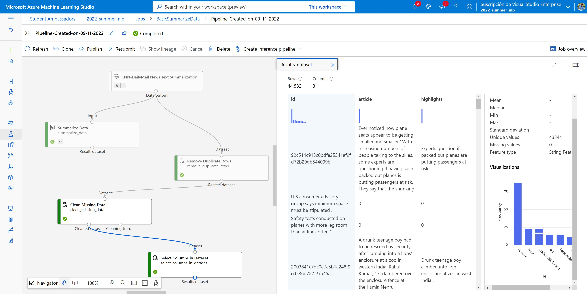

# Quick Reader

Don't read the  book :trollface: , just use Quick Reader   :sunglasses:

- Text summarization
- Information retrieval
- Finding similarities 
- Sentence ranking
- Keyword extraction
- and many more in progress..

## More about Project

* Keyword extraction is an extremely interesting topic in Information Retrieval- keywords are widely acknowledged to be extremely important in the field of text retrieval, and particularly while developing large scale modern search engines that limit the size of the inverted index used by the system.

* In this project we propose to build a system using modern NLP techniques such as Part of Speech Tagging, Brown Clustering and Rapid Automatic Keywords Extraction (RAKE) to use a small initial seed of keywords to generate more candidate keywords in a semi-supervised manner and expose the system as a JSON based web service.

* The proposed system mainly focuses on scraping the data from image and providing the summary as well as keywords from the information extracted from  image

* Quick Reade is really helpful for the visually impaired,  it will take image containing text as the input, extracts the text from the image, and converts this text to speech, it will summarize the text of the image for them.

## How does the Quick Reader works?

It follows following Steps:

1. Scan text
2. Extract Text
4.  Summarizers
5. Rankers
6. Similarity Algorithms
7. Information Retrievers
8. Keyword Extractors

      
All those steps has been done with Azure Machine Learning
##  Azure Machine Learning 

Azure Machine Learning provides the following MLOps capabilities:

- **Machine Learning pipelines** allow you to define repeatable and reusable steps for your data preparation, training, and scoring processes.
- **Create reusable software environments** for training and deploying models.
- **Register, package, and deploy models** from anywhere. You can also track associated metadata required to use the model.
- **Capture the governance data** for the end-to-end ML lifecycle. The logged information can include who is publishing models, why changes were made, and when models were deployed or used in production.
- **Notify and alert on events in the ML lifecycle**. For example, experiment completion, model registration, model deployment, and data drift detection.
- **Monitor ML applications for operational and ML-related issues**. Compare model inputs between training and inference, explore model-specific metrics, and provide monitoring and alerts on your ML infrastructure.
- **Automate the end-to-end ML lifecycle with Azure Machine Learning and Azure Pipelines**. Using pipelines allows you to frequently update models, test new models, and continuously roll out new ML models alongside your other applications and services.

 ## My Special task:
 - Getting Data from Kaddle (CNN daily mail)
 - Uploaded it to Azure Machine Learning Studio 
 - Clean data with Designer in Azure ML
 
 
